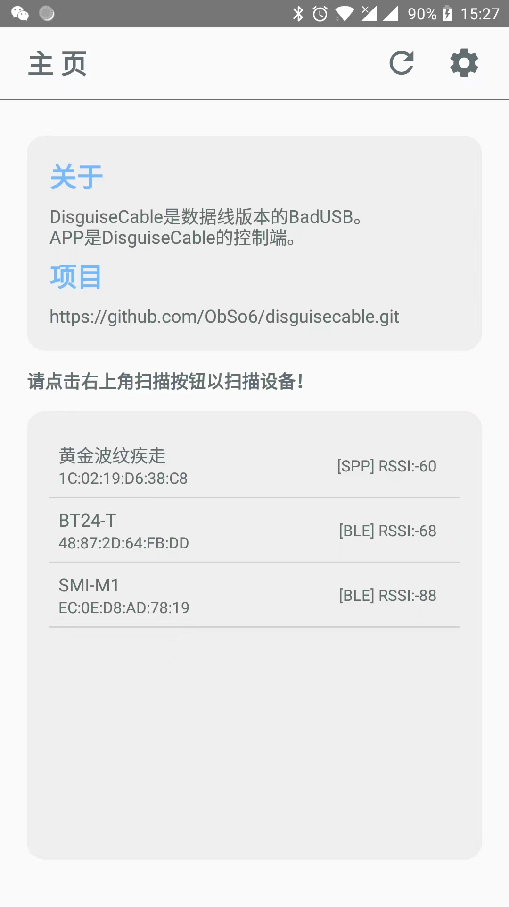
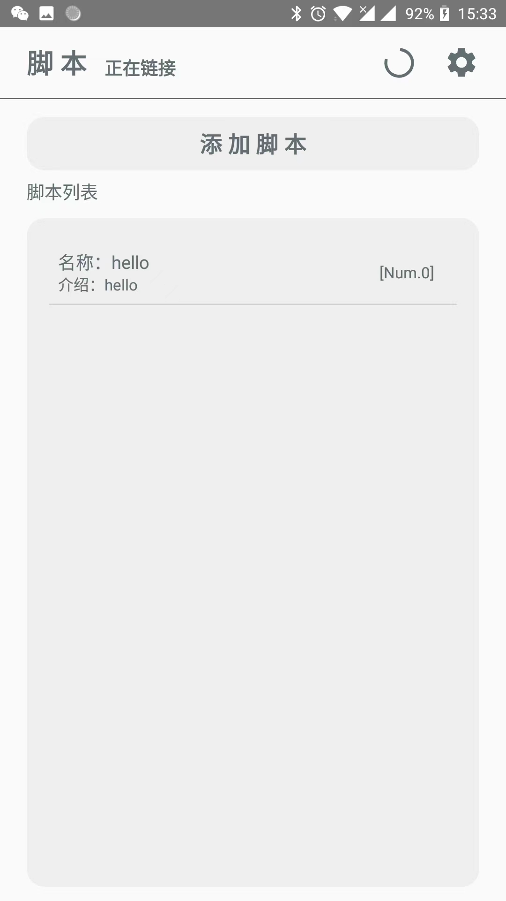
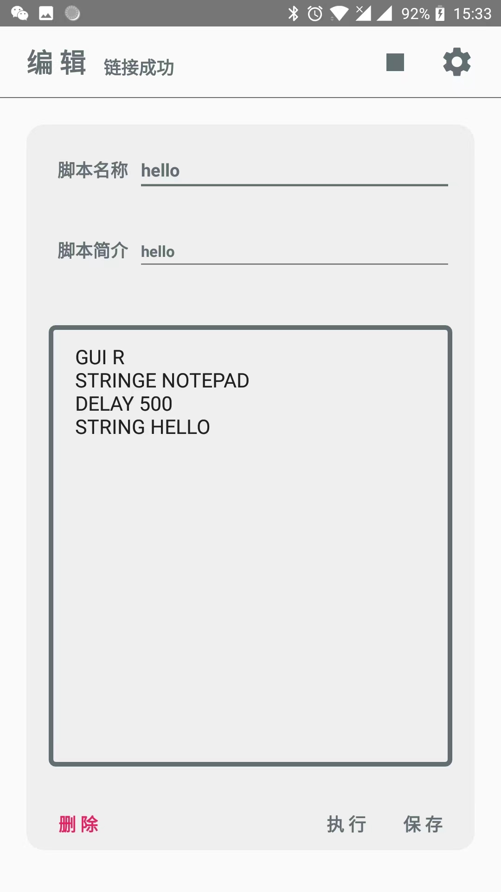
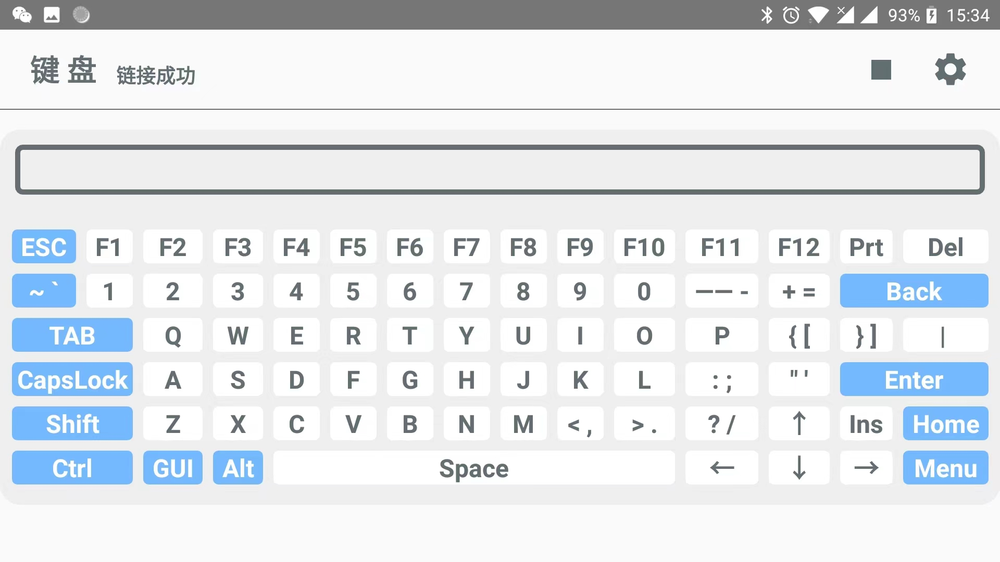

# DisguiseUSBCable

蓝牙控制的低成本伪装成数据线的BadUSB。:)

#### BadUSB

一个写入了恶意代码的定制USB设备，例如U盘，将其插入到电脑设备后，它会伪装成HID设备（鼠标，键盘等），然后执行恶意代码。

#### DisguiseUSBCable

一个样式模拟USB数据线的BADUSB设备，相对应的APP用于操控。

#### 设备功能

1. 对蓝牙设备进行扫描，以便发现DisguiseUSBCable。

2. 键盘模拟，对于全键盘进行模拟。

3. HID攻击，完整的兼容BadUSB的DuckyScript脚本，关于脚本说明。

   [脚本说明]: Markdown/DuckyScript.md

4. 脚本编辑与修改。

5. 数据线进行默认充电（待定）。

   。。。。。。

#### 硬件说明

一个HID执行芯片，一个蓝牙芯片，一个稳压芯片

HID:	CH9328

蓝牙:	DX-BAT24-T

稳压:	LP2992

#### 软件说明

主页扫描页面

hid攻击页面

编译脚本页面

键盘模拟页面

